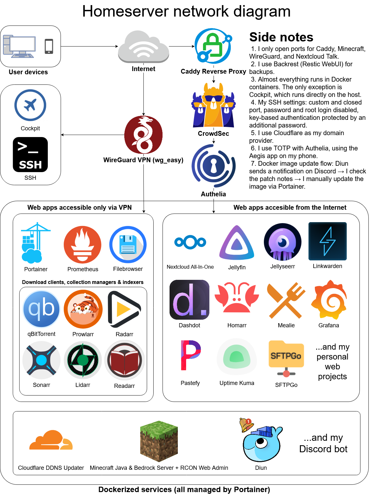

# Homeserver - Port Forwarding

In this section I will help you setup your personal server using ***Port Forwarding***.

This is much more demanding and potentially less secure approach than selfhosting with ***Cloudflare Tunnels*** but gives you much more control and greater possibilities.

## Goals & Features
After following this tutorial you will have:
- Secure access to your selfhosted web services using [Caddy Reverse Proxy with Cloudflare DNS addon](https://github.com/SlothCroissant/caddy-cloudflaredns)
- Remote access to your server from anywhere using [WireGuard VPN with WebUI](https://github.com/wg-easy/wg-easy)
- Couple of web or standalone dockerized services
- Minecraft server with ***mc.your-domain.tld***

In the end your server may look like this (diagram made by me in [draw.io](https://draw.io/)):

## 1. Public IP and Port Forwarding

If your ISP offers a static IP address then get it. It won't cost that much and it will make your life easier. Also ensure if your ISP **doesn't block** port forwarding for certain or all ports.

If your ISP doesn't offer static IP then you have to get your own router. Otherwise you don't have to do it but I really recommend you to get one. I personally use [ASUS RT-AX53U](https://www.asus.com/networking-iot-servers/wifi-routers/asus-wifi-routers/rt-ax53u/) which costed me about 50 euro.

With dynamic public IP you have the problem that it is... Well dynamic haha. So it changes. With various frequency but it eventually changes. 

You have to use [DDNS](https://en.wikipedia.org/wiki/Dynamic_DNS). Most ASUS devices have it already built-in in router with DDNS address that looks like ``your-name.asuscomm.com``. Check if your device has such function. If not or you think ASUS DDNS isn't reliable, then you can always use different methods to do it. 

One such a method is using Cloudflare for DDNS to create A/AAAA records pointing to your domain. I have docummented it in [Cloudflare DDNS](services/cloudflare_ddns) service.

When you set up everything you need to forward these ports:

| **Service name** 	| **External port** 	| **Internal port** 	| **Internal IP address** 	| **Protocol** 	|   **Note**  	|
|:----------------:	|:-----------------:	|:-----------------:	|:-----------------------:	|:------------:	|:-----------:	|
|       HTTP       	|         80        	|         80        	| YOUR_SERVER_INTERNAL_IP 	|      TCP     	|    caddy    	|
|       HTTPS      	|        443        	|        443        	| YOUR_SERVER_INTERNAL_IP 	|    TCP/UDP   	|    caddy    	|
|     Minecraft Java    	|       25565       	|       25565       	| YOUR_SERVER_INTERNAL_IP 	|    TCP/UDP   	|      mc     	|
|     Minecraft Bedrock    	|       19132       	|       19132       	| YOUR_SERVER_INTERNAL_IP 	|    UDP   	|      mc     	|
|   WireGuard VPN  	|       51820       	|       51820       	| YOUR_SERVER_INTERNAL_IP 	|      UDP     	|   wg_easy   	|
|      NC Talk     	|        3478       	|        3478       	| YOUR_SERVER_INTERNAL_IP 	|    TCP/UDP   	| nc_talk_app 	|

**Legend:**
- ***caddy***: required for Caddy Reverse Proxy to work; essential for having working, accessible over Internet, server
- ***mc***: required for Minecraft Java server (25565/tcp), query (25565/udp) and Bedrock server (19132/udp)
- ***wg_easy***: required for WireGuard VPN to work; essential for accessing server over VPN tunnel
- ***nc_talk_app***: required for NextCloud AIO Talk app to work 

## 2. Install Your Preferred Linux Distribution

For the distribution, I chose [AlmaLinux 9.6 (Sage Margay)](https://almalinux.org/) because it’s open source, community-owned and binary-compatible with RHEL. It also focuses on long-term stability and security, which is especially important for me because this time I want to essentially "set and forget" my server and have minimal personal maintenance.

It has great documentation on its own and thanks to being binary compatible with RHEL you can also use docs designed for RHEL, Rocky Linux, CentOS and many more RHEL clones.

- ### 2a. Install your system and get recommended software

    I highly recommend following all documentation below in that order:

	- [Installation](https://wiki.almalinux.org/documentation/installation-guide.html)
	- [After-Installation](https://wiki.almalinux.org/documentation/after-installation-guide.html)
	- [FirewallD](https://www.answertopia.com/almalinux/almalinux-firewall-configuration-with-firewalld/)
	- [Docker](https://techviewleo.com/how-to-install-docker-ce-on-almalinux/)
	- [SSH with keys](https://www.answertopia.com/almalinux/configuring-ssh-key-based-authentication-on-almalinux/)

	For more of the offical AlmaLinux documentation you can check [AlmaLinux Wiki](https://wiki.almalinux.org/).

- ### 2b. Change shell (optional)
	Change your default shell to [zsh](https://www.zsh.org/) and enable plugins wiht [oh-my-zsh](https://ohmyz.sh/).

	I installed [zsh-autosuggestions](https://github.com/zsh-users/zsh-autosuggestions) and [zsh-syntax-highlighting](https://github.com/zsh-users/zsh-syntax-highlighting) plugins.

## 3. Services
At this point you have entire required infrastucture running so you can finally have some fun exploring various selfhosted services :D

In every case you need to run:
- **[Caddy](services/caddy)** - makes your sites more secure, more reliable, and more scalable than any other solution.
- **[WireGuard Easy](services/wg_easy)** - the easiest way to run WireGuard VPN + Web-based Admin UI.
- **[Portainer](services/portainer)** - easy managment for your Docker stuff.

Only required if you don't have static public IP:
- **[Cloudflare DDNS](services/cloudflare_ddns)** - small, feature-rich, and robust Cloudflare DDNS updater.

Recommended:
- **[Authelia](services/authelia)** - a single sign-on multi-factor portal for web apps.
- **[Filebrowser](services/filebrowser)** - a web file browser.
- **[Backrest](services/backrest)** - a web UI and orchestrator for restic.

Personal preference:
- **[Nextcloud All-In-One](services/nextcloud_aio)** - the official Nextcloud installation method.
- **[Dashdot](services/dashdot)** - a modern server dashboard.
- **[Gitea](services/gitea)** - a selfhosted Git with a cup of tea!
- **[Homarr](services/homarr)** - customizable browser's home page for your homeserver.
- **[Linkwarden](services/linkwarden)** - collaborative bookmark manager to collect, organize, and preserve webpages and articles. 
- **[Mealie](services/mealie)** - a recipe manager for the modern household.
- **[Pastefy](services/pastefy)** - an open source self-hostable Pastebin.
- **[Jellyfin & Jellyseerr](services/jellyfin_jellyseerr)** - a free software media system that puts you in control of managing and streaming your media with app for managing requests for your media library.
- **[qBittorrent & Collections](services/qbittorrent_collections)** - download client and collection managers for your media server.
- **[Minecraft](services/minecraft)** - Minecraft server with your own IP.
- **[Uptime Kuma](services/uptime_kuma)** - a fancy selfhosted monitoring tool.
- **[Grafana & Prometheus](services/grafana_prometheus)** - an open and composable observability and data visualization platform with Prometheus data source.
- **[Watchtower](services/watchtower)** - update your Docker containers automatically.