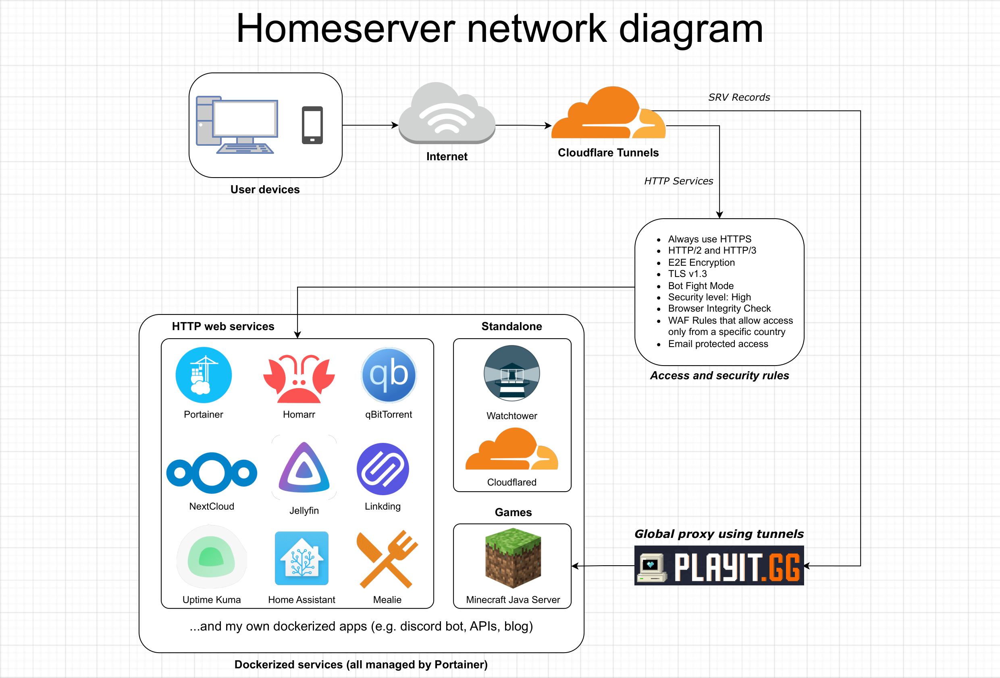

# Homeserver - Cloudflare Tunnels

In this section I will help you setup your personal server using ***Cloudflare Tunnels***. Use this if you either can't or prefer not to forward ports on your router.

## Goals & Features
After following this tutorial you will have:
- Secure access to your selfhosted web services using [Cloudflare Tunnels](https://developers.cloudflare.com/cloudflare-one/connections/connect-apps/)
- Remote access from the Internet using [VNC](https://en.wikipedia.org/wiki/Virtual_Network_Computing)
- Remote access from **your LAN** using [SSH](https://en.wikipedia.org/wiki/Secure_Shell)
- Shared over LAN folders using [Samba](https://en.wikipedia.org/wiki/Samba_(software))
- Couple of web or standalone dockerized services
- Minecraft server with ***mc.your-domain.tld***

In the end your server may look like this (diagram made by me in [draw.io](https://draw.io/)):



## 1. Install Your Preferred Linux Distribution

For the Linux distro, I will use [EndeavourOS](https://endeavouros.com/), but you can use any Arch-based distro (e.g. Manjaro, Garuda, or plain Arch) to essentially copy-paste commands. I chose EndeavourOS, because it comes with some useful stuff (that I will eventually need) installed and already configured and it has ISOs with many DE (KDE Plasma, Gnome, Xfce4 and more). If you opt for a non-Arch-based distro, you will need to find equivalent instructions for your chosen distribution.

- ### 1a. Update your system
	If you are using EndeavourOS just run ``yay``. For other distros find equivalent instructions.

- ### 1b. Turn off auto-sleep (only if using graphical environment or/and VNC)
	This depends of your distribution and your graphical environment. Just google how to do that. It shouldn't be complicated.

- ### 1c. Change shell (optional)
	Change your default shell to [zsh](https://www.zsh.org/) and enable plugins with [oh-my-zsh](https://ohmyz.sh/)

## 2. Remote connection
Setup VNC and SSH to remote access your server.

> **IMPORTANT!** You need to either download some dummy X11 driver (not recommended) or buy dummy HDMI adapter for about 4 euro (recommended).

- ### 2a. VNC
	- 1. Install [RealVNC Viewer](https://www.realvnc.com/en/connect/download/viewer/) on your client (in my case Windows 11 Home).
	- 2. Install RealVNC Server on your server:

	```bash
	yay -S realvnc-vnc-server
	```
	```bash
	sudo systemctl enable --now vncserver-x11-serviced
	```
 
	After you do this, login to your RealVNC account on RealVNC Server. Make sure you check ``SHA-256`` encryption.
	Reboot and boom! You have encrypted VNC connection! With VNC you can connect to your server **from anywhere**.
- ### 2b. SSH
  	``SSH`` server should be pre-installed on most Linux distros but if it isn't on yours, then you have to install it to complete steps below.

  	```bash
	sudo systemctl enable --now sshd
  	```

  	now you can connect from any device within your LAN to your server by command:
  
  	```bash
    ssh <username>@<hostname/your_local_ipv4_address>
   	```

	for example:
   	```bash
   	ssh myAwesomeLinuxUsername@192.168.0.18
   	```
    
  	type password for your user and congrats! You are connected via SSH! With SSH you can connect to your server **from LAN only**. 
	
	I also recommend setting key-based auth as well as disable ``root`` login and password login. Everything about that is covered in **Port Forwarding** part of this repository.

	If you want to connect from the Internet you can check something like [Tailscale](https://tailscale.com/) or buy some VPS.

## 3. Docker & Docker Compose
Setup Docker with Docker Compose and add your user to "docker" group. This steps may vary depending on your Linux distro.

> Visit offical [docker](https://docs.docker.com/compose/install/linux) website for instructions for your distribution

- ### 3.1. Install Docker and add user to "docker" group
	```bash
	yay -S docker
	```
	```bash
	sudo usermod -aG docker $USER
	```
	```bash
	newgrp docker
	```
	```bash
	sudo systemctl enable --now docker
	```
- ### 3.2 Install ``docker-compose`` plugin
	```bash
	DOCKER_CONFIG=${DOCKER_CONFIG:-$HOME/.docker}
	```
	```bash
	mkdir -p $DOCKER_CONFIG/cli-plugins
	```
	```bash
	curl -SL https://github.com/docker/compose/releases/download/v2.19.1/docker-compose-linux-x86_64 -o $DOCKER_CONFIG/cli-plugins/docker-compose
	```
	```bash
	chmod +x $DOCKER_CONFIG/cli-plugins/docker-compose
	```

### 4. Network & Firewall
Install and enable firewall to prevent common attacks:
```bash
yay -S firewalld
```
```bash
sudo systemctl enable --now firewalld.service
```

### 5. Shared folders
Install ``Samba`` package:
```bash
yay -S samba
```

As ``Samba`` doesn't come with config file, we need to create one. I will use official config file from [Samba repository](https://git.samba.org/samba.git/?p=samba.git;a=blob_plain;f=examples/smb.conf.default;hb=HEAD).

Paste this config here:
```bash
sudo nano /etc/samba/smb.conf
```
In the section ``[global]`` change ``workgroup`` to following:
```bash
workgroup = WORKGROUP
```
so it will match Windows's default one.

- ### 5.1 Configure firewall
	In order to access your samba share from other computers, you must change your firewall's setting:
	```bash
	firewall-cmd --permanent --zone=public --add-service=samba
	```
	```bash
	firewall-cmd --reload
	```
	```bash
	systemctl enable --now smb.service
	```

- ### 5.2 Samba group
	Create ``sambausers`` group and add yourself to it:
	```bash
	sudo groupadd -r sambausers
	```
	```bash
	sudo usermod -aG sambausers YOUR_USERNAME
	```
	Create samba password for your shares:
	```bash
	sudo smbpasswd -a YOUR_USERNAME
	```

- ### 5.3 Example share
	I will use my Jellyfin media library as an exemplary yet practical share.

	Scroll to the bottom and add:
	```bash
	[Media]
	comment = Jellyfin Media
	path = /srv/server/media
	writable = yes
	browsable = yes
	create mask = 0700
	directory mask = 0700
	read only = no
	guest ok = no
	```

	> At this point make sure that directory you specified in share's path **actually exists**! If not run [Jellyfin](services/jellyfin) service or create it manually with:
	> ``sudo mkdir /srv/server/media``

	Change directory ownership and permissions:
	```bash
	sudo chown -R :sambausers /srv/server/media
	```
	```bash
	sudo chmod 1770 /srv/server/media
	```


## 5. Services
Setup [Cloudflare Tunnels](services/tunnels) with [Portainer](services/portainer) to allow access to your services outside your home network, then add as many services as you want.

> **IMPORTANT!** Remember to add 2FA through Cloudflare Tunnels dashboard to some sensitive services such as Portainer.

In every case you need to run. 
- **[Cloudflare Tunnels](services/tunnels)** - making services accesible outside your home network.
- **[Portainer](services/portainer)** - easy managment for your Docker stuff.

Personal preference:
- **[Jellyfin](services/jellyfin)** - the free software media system.
- **[Jellyseerr](services/jellyseerr)** - an application for managing request for your media library.
- **[NextCloud](services/nextcloud)** - a safe home for all your data.
- **[Homarr](services/homarr)** - customizable browser's home page for your homeserver.
- **[Mealie](services/mealie)** - a recipe manager for the modern household.
- **[Linkding](services/linkding)** - selfhosted bookmark manager.
- **[Uptime Kuma](services/uptime_kuma)** - a fancy selfhosted monitoring tool.
- **[Minecraft](services/minecraft)** - Minecraft server with your own IP.
- **[Dashdot](services/dashdot)** - a modern server dashboard.
- **[Watchtower](services/watchtower)** - update your Docker containers automatically.
- **[qBittorrent](services/qbittorrent)** - qBittorrent BitTorrent client.
- **[Starr Apps](services/starr_apps)** - collection managers apps with similar functionalities for anime, tv shows, movies, music and ebooks.
- **[Home Assistant](services/homeassistant)** - open source home automation that puts local control and privacy first.
- **[Custom service](services/custom)**